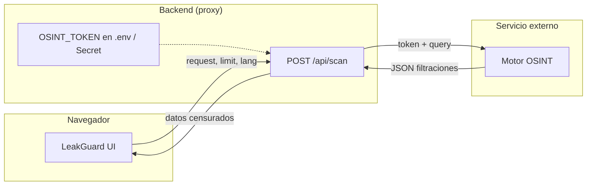

<p align="center">
  
</p>

<h1 align="center">LeakGuard</h1>

<p align="center">
  Plataforma de <strong>Threat Intelligence</strong> y verificación de filtraciones con escaneo OSINT, credenciales censuradas y proxy seguro.
</p>

<p align="center">
  
  
  
  
</p>

---

## Tabla de contenidos

- [Descripción](#descripción)
- [Características](#características)
- [Arquitectura](#arquitectura)
- [Inicio rápido](#inicio-rápido)
- [Configuración del token](#configuración-del-token)
- [Despliegue en Firebase](#despliegue-en-firebase)
- [Seguridad](#seguridad)
- [Estructura del proyecto](#estructura-del-proyecto)
- [Módulos de la plataforma](#módulos-de-la-plataforma)

---

## Descripción

**LeakGuard** es una aplicación web orientada a analistas de ciberseguridad. Permite auditar la exposición de activos digitales (dominios, correos y teléfonos) consultando índices OSINT de filtraciones, visualizando resultados con **contraseñas parcialmente censuradas** y calculando un **porcentaje de riesgo** basado en los hallazgos.

El diseño prioriza la seguridad operativa: las credenciales de la API externa **nunca se exponen en el navegador** gracias a un proxy backend.

---

## Características

| Módulo | Descripción |
|--------|-------------|
| **Exposure Check** | Búsqueda por dominio, correo o teléfono con resultados censurados |
| **Dashboard** | KPIs, gráficos y feed de inteligencia de amenazas |
| **Threat Details** | Análisis forense, impacto y recomendaciones por incidente |
| **Admin Panel** | Cola de verificación humana y trazabilidad de auditoría |
| **AI Safety** | Métricas de transparencia y pipeline de decisión |

**Exposure Check incluye:**

- Porcentaje de riesgo calculado según volumen y severidad de filtraciones
- Conteo total de logins / credenciales indexadas
- Tabla completa de registros devueltos por la API (sin límite artificial)
- Recomendaciones de mitigación (inmediato, 24 h, 7 días)
- Proxy `/api/scan` — el token no aparece en F12 ni en el código frontend

---

## Arquitectura



> El navegador solo envía `{ "request", "limit", "lang" }`. La API key permanece en el servidor.

---

## Inicio rápido

### Requisitos

- [Node.js](https://nodejs.org/) 18 o superior
- Token OSINT (obtenido desde el bot del proveedor con el comando `/api`)
- *(Opcional)* [Firebase CLI](https://firebase.google.com/docs/cli) para despliegue en producción

### 1. Clonar el repositorio

```bash
git clone https://github.com/paltaunkwnow/LEAKGUARD.git
cd LEAKGUARD
```

### 2. Configurar el token en el servidor

```bash
cd proxy
cp .env.example .env
```

Edita `proxy/.env`:

```env
OSINT_TOKEN=tu_token_aqui
PORT=8787
```

### 3. Instalar dependencias e iniciar

```bash
npm install
npm start
```

### 4. Abrir la aplicación

Visita **[http://localhost:8787](http://localhost:8787)**

> **Importante:** no abras `index.html` directamente. El proxy local es necesario para que `/api/scan` funcione y el token no quede expuesto.

---

## Configuración del token

| Entorno | Ubicación del token | Comando |
|---------|---------------------|---------|
| Desarrollo local | `proxy/.env` | `npm start` en `proxy/` |
| Producción Firebase | Secret `OSINT_TOKEN` | Ver sección de despliegue |

El archivo `proxy/.env` está en `.gitignore` y **no debe subirse** al repositorio.

---

## Despliegue en Firebase

### 1. Configurar el secret

```bash
firebase functions:secrets:set OSINT_TOKEN
```

Introduce tu token cuando se solicite.

### 2. Instalar dependencias de Functions

```bash
cd functions
npm install
cd ..
```

### 3. Desplegar hosting + functions

```bash
firebase deploy --only functions,hosting
```

La ruta `/api/scan` queda enrutada a la Cloud Function `scanProxy` definida en `firebase.json`.

---

## Seguridad

### Qué ve el analista en F12 (Network)

```http
POST /api/scan
Content-Type: application/json

{
  "request": "analista@empresa.com",
  "limit": 500,
  "lang": "es"
}
```

### Qué **no** se expone

- URL del proveedor OSINT externo
- API key / token de autenticación
- Payload completo con credenciales del servicio

### Buenas prácticas incluidas

- Token almacenado solo en variables de entorno del servidor
- Contraseñas y hashes mostrados parcialmente censurados en la UI
- `.gitignore` para `proxy/.env`, `config.js` y secretos locales

---

## Estructura del proyecto

```
LEAKGUARD/
├── index.html          # Shell principal de la aplicación
├── app.js              # Lógica frontend (router, OSINT, dashboard)
├── styles.css          # Estilos personalizados + glassmorphism
├── firebase.json       # Hosting + rewrite /api/scan → Cloud Function
├── .firebaserc         # Proyecto Firebase
│
├── proxy/              # Servidor de desarrollo local
│   ├── server.js       # Express: estáticos + POST /api/scan
│   ├── .env.example    # Plantilla de configuración
│   └── package.json
│
└── functions/          # Firebase Cloud Functions (producción)
    ├── index.js        # scanProxy — proxy seguro OSINT
    └── package.json
```

---

## Módulos de la plataforma

### Exposure Check

Audita dominios corporativos, correos electrónicos y números telefónicos. Muestra:

- **Riesgo de exposición real** (% con barra de progreso)
- **KPIs:** logins encontrados, bases filtradas, contraseñas en texto claro
- **Tabla de filtraciones** con login, credencial censurada y severidad
- **Recomendaciones** priorizadas por urgencia

### Dashboard & Threat Feed

Monitorización simulada de inteligencia de amenazas con KPIs, gráficos Chart.js y cola de incidentes verificables.

### Admin Panel

Flujo *human-in-the-loop* para verificar, rechazar o solicitar evidencia adicional sobre incidentes detectados.

---

<p align="center">
  <sub>LeakGuard · Threat Intelligence & Leak Verification · 2026</sub>
</p>
