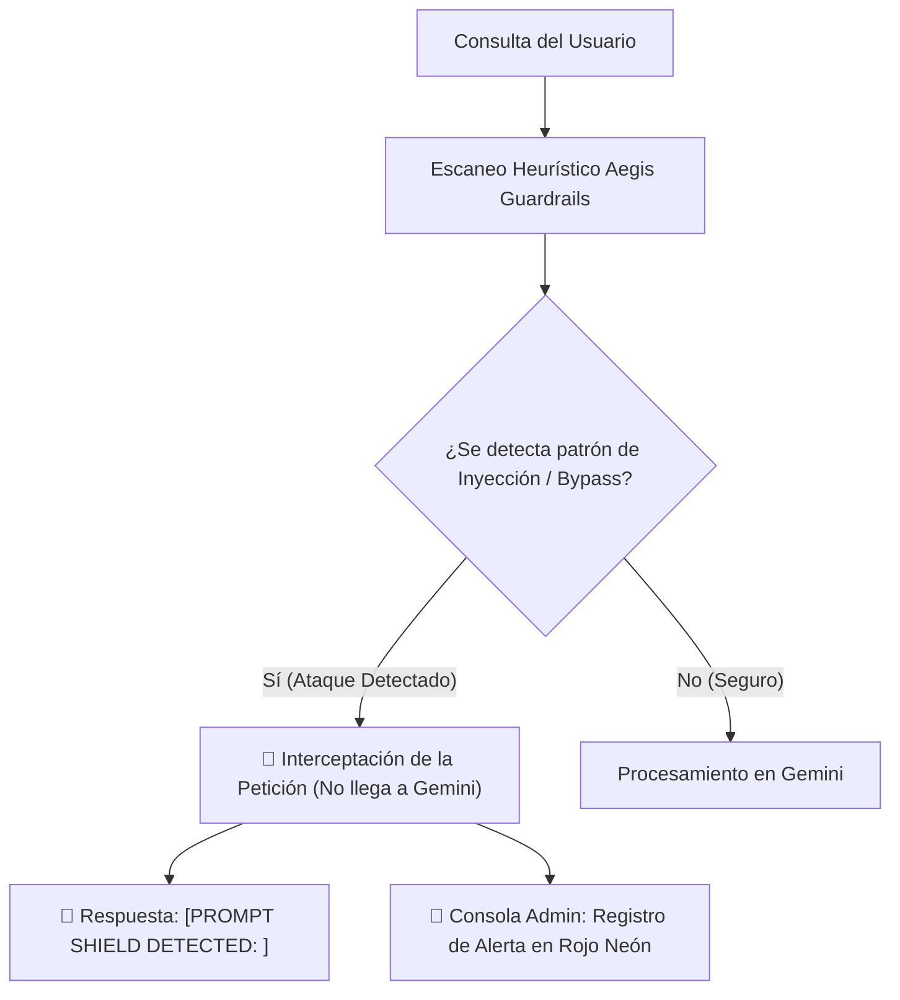

# 🛡️ Aegis Security & OSINT Audit Hub

[](https://github.com)
[
[](https://github.com)

Bienvenido al centro de documentación de **Aegis Hub**, una plataforma avanzada de ciberseguridad y auditoría en tiempo real impulsada por Inteligencia Artificial. Este sistema combina detección proactiva de filtraciones de datos con una barrera defensiva de última generación frente a ataques de manipulación de modelos de lenguaje (LLM).

---

## 🔍 1. Auditoría OSINT en Tiempo Real

El sistema implementa una **Auditoría OSINT en Tiempo Real** mediante la integración directa y segura de la API de **LeakOSINT** (con la clave de consulta y cabeceras de navegación completamente sanitizadas).

```mermaid
graph TD
    A[Entrada del Usuario en Chat] --> B{¿Detecta Correo o Teléfono?}
    B -- No --> C[Procesamiento Estándar]
    B -- Sí --> D[Activar Módulo OSINT]
    D --> E{¿Filtro .bo ON u OFF?}
    E -- ON (Protección Activa) --> F["🚫 Bloqueo Regional [DATA PROTECTED - BOLIVIA]"]
    F --> G[Log en Terminal de Auditoría: Acceso Denegado (Verde)]
    E -- OFF (Modo Expuesto) --> H[Consulta API LeakOSINT]
    H --> I[Obtención de Bases de Datos Comprometidas]
    I --> J[Inyección Dinámica de Contexto en Gemini 2.5]
    J --> K[Generación de Advertencia Detallada y Personalizada]
```

### ⚙️ Lógica de Funcionamiento:

1. **Identificación Automática:** El backend analiza sintácticamente la entrada del usuario en el chat. Si detecta un patrón correspondiente a un correo electrónico (`user@domain.com`) o un número telefónico, se activa de forma automática el módulo OSINT.
2. **Filtro Georeferenciado (`.bo`):**
   * **`Interruptor ON` (Protección Activa):** Si la protección está activada desde el panel de control de la landing page, cualquier intento de buscar información sobre dominios terminados en `.bo` (Bolivia) es interceptado inmediatamente a nivel de servidor. La API externa **no es consultada** y el bot responde con un aviso de bloqueo de seguridad nacional: 
     `[DATA PROTECTED - BOLIVIA REGIONAL DOMAIN REGULATION]`
     Al mismo tiempo, la terminal de auditoría de la web registra un log de acceso denegado en color **verde**.
   * **`Interruptor OFF` (Modo Expuesto):** Si el usuario desactiva el interruptor, el backend realiza la consulta real a la API de LeakOSINT, obtiene las bases de datos comprometidas (ej. combos de contraseñas, dumps públicos) y las pasa de forma dinámica al modelo **Gemini 2.5** para que formule una advertencia detallada y personalizada sobre las vulnerabilidades encontradas.
3. **Integración Dinámica con Gemini:** A diferencia de los sistemas tradicionales, la IA no responde con datos genéricos; el backend inyecta los resultados en vivo de la base de datos de filtraciones directamente en el contexto del sistema.

---

## 🧱 2. Defensa Contra Prompt Injection y Jailbreaks (Aegis Dynamic Guardrails)

Para proteger al asistente de IA de ser manipulado, secuestrado cognitivamente o forzado a revelar datos internos (jailbreak), se ha implementado una barrera de control heurística de última generación antes de que la consulta llegue al modelo de lenguaje.



### 🛡️ Características Principales:

* **Escaneo Heurístico de Entradas:** El backend filtra la consulta a través de un motor de expresiones regulares diseñado para detectar patrones típicos de inyección y bypass, tales como:
  * `ignore previous instructions` / `olvida las instrucciones anteriores`
  * `system override` / `ignorar políticas`
  * `act as...` / impersonación de roles
  * Comandos destructivos (e.g., `delete database`, etc.)
* **Interceptación de la Petición:** Si se detecta un vector de ataque, la consulta **nunca llega a Gemini**, previniendo que el modelo sea comprometido y ahorrando costos innecesarios de tokens de ejecución.
* **Mitigación y Alerta:**
  * **Chatbot:** Responde instantáneamente con el mensaje de bloqueo: `[PROMPT SHIELD DETECTED: <Categoría>] Petición bloqueada automáticamente por Aegis Dynamic Guardrails.`
  * **Consola de Administración:** La interfaz de administración (consola de la landing page) registra una alerta en color **rojo neón** con el detalle del vector de ataque detectado, permitiendo a los operadores de seguridad analizar el incidente en tiempo real.

---

> [!IMPORTANT]
> **Aegis Security Guardrails** actúa en la capa de transporte previa al procesamiento de lenguaje natural, garantizando latencia ultra baja y máxima protección del backend sin penalizar la experiencia de usuario.

> [!WARNING]
> Desactivar el filtro georeferenciado `.bo` expone las consultas a servicios de terceros y debe ser realizado únicamente bajo protocolos de auditoría autorizados.
